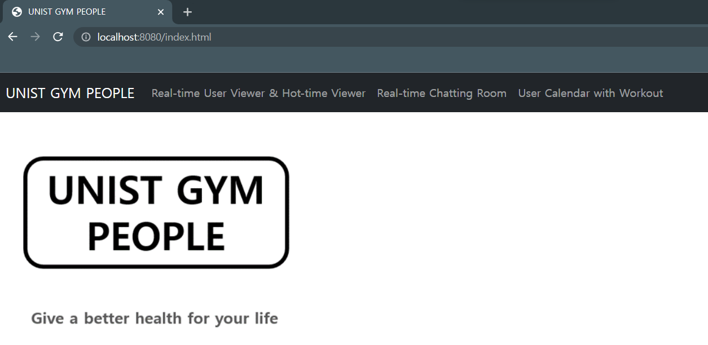
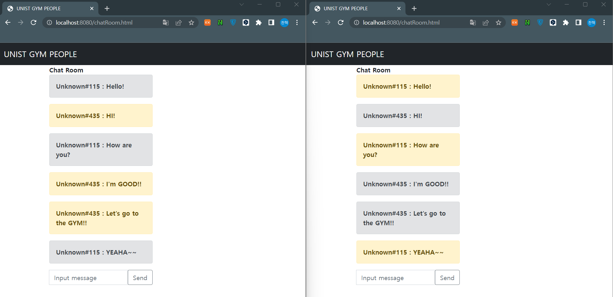
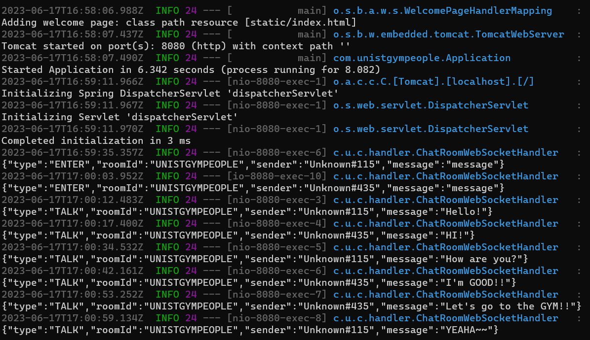
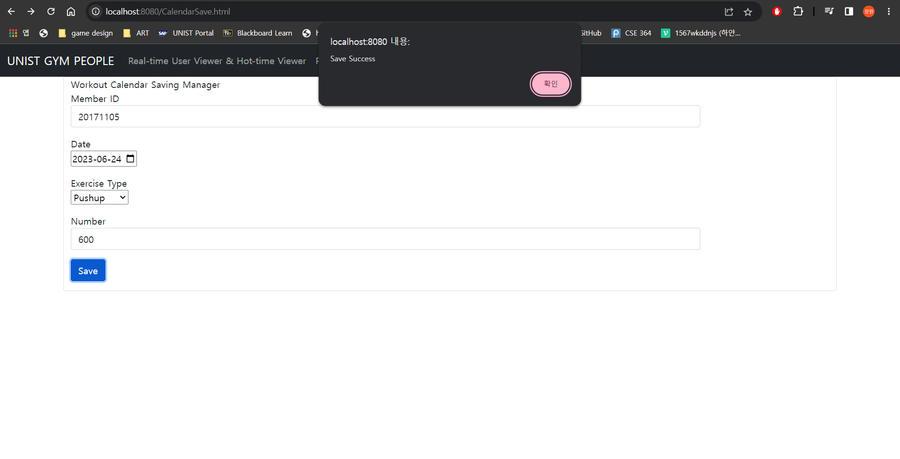

# CSE364Project
2023 CSE364 Group 28 Project - Milestone 2

## Part 1 : Create Git branches

You can execute `sh run.sh` as the following:
```
git clone https://github.com/ChanHyeok-Choi/CSE364Project.git
cd CSE364Project

# Create User Administrator MongoDB
mongod --fork --logpath /var/log/mongodb.log
mongosh admin --eval "db.createUser({ user: 'admin', pwd: 'password', roles: ['userAdminAnyDatabase'] })"

# Import data/*.csv to MongoDB
mongoimport --db=cse364 --collection=users --authenticationDatabase admin --username admin --password password --type=csv --file=data/users.csv --fields=userId.int32\(\),timeStamp.string\(\),userType.string\(\) --columnsHaveTypes
mongoimport --db=cse364 --collection=usernums --authenticationDatabase admin --username admin --password password --type=csv --file=data/usernums.csv --fields=date.string\(\),time.string\(\),userNumber.int32\(\) --columnsHaveTypes

mongoimport --db=cse364 --collection=calender --authenticationDatabase admin --username admin --password password --type=csv --file=data/calender.csv --fields=memberid.int32\(\),time.string\(\),event.string\(\),num.int32\(\) --columnsHaveTypes
mongoimport --db=cse364 --collection=exercise --authenticationDatabase admin --username admin --password password --type=csv --file=data/exercise.csv --fields=exercisetype.string\(\),percalorie.int32\(\) --columnsHaveTypes

mvn package
java -jar target/cse364-project-1.0-SNAPSHOT.jar
```

---

## Part 2 : Build Web Application (120 points, 40 points for each feature)

### Feature 1 : Real-Time User Viewer

### Feature 2 : Real-Time Chat Service

Before users start using live chat rooms, there is one prerequisite in server.

* Create the first open chat room by REST-API.
   ```
   curl -X POST http://localhost:8080/chat -H "Content-Type: application/json" -d "{ \ "name" : "ChatRoom1" \ }"
   > {"roomId":"UNISTGYMPEOPLE","name":"{ \\ name : ChatRoom1 \\ }","sessions":[]}
   ```

Then, users can automatically connect to the websocket when they open `http://localhost:8080/chatRoom.html`.
And users are given a random name: e.g., `Unknown#123` (Arbitrary number range: 1 ~ 500). And if they input
some messages and send them by the send button, text boxes that appear depend on the sender and receiver.

### Feature 3 : User's Workout Calender

---
  
## Part 3 : Deploy Application (40 points)

---

## Part 4 : Use Continuous Integration (GitHub Actions) (20 points)


---

## Part 5 : Write User Documentation (15 points)

When users firstly open our web application through `http://localhost:8080/chatRoom.html`, they can see our
logo as the following:


### Feature 1 : Real-Time User Viewer

### Feature 2 : Real-Time Chat Service

Users just open or access the url: `http://localhost:8080/chatRoom.html`. And then, they input a text message
and eventually click the send button for sending it to other users. You can see the example as the following:

The relevant logs can be showed on the server as following:


### Feature 3 : User's Workout Calender

To save the event on date, access the url: `http://localhost:8080/CalendarSave.html`. 

Or access from`http://localhost:8080/Calender.html` and click the "Save new" Button.

And then, input a Member Id, Date, Exercise Type, and Number value to save the data to database.

If success, "Save Success"  will appear but if fails, "Error" will appear. And it directs them to `http://localhost:8080/Calender.html`.



To view the event on date you saved, access the url `http://localhost:8080/Calender.html`.

To search, fill the Member Id and Date, and it will show the data they saved in the table

and below table shows the total calorie they spent on that specific date.

Button "Save new" directs them to `http://localhost:8080/CalendarSave.html`.


