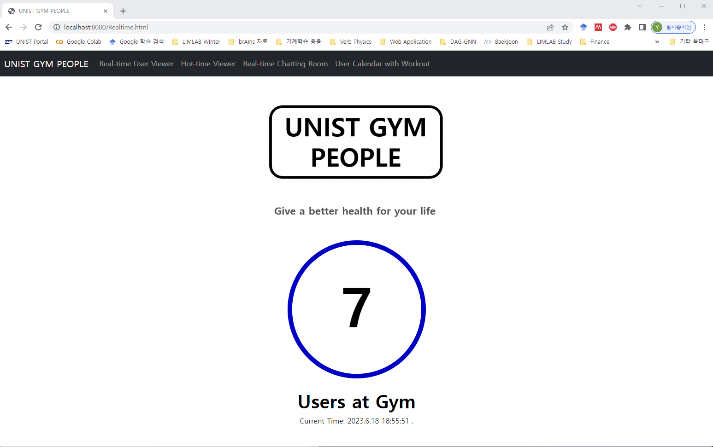
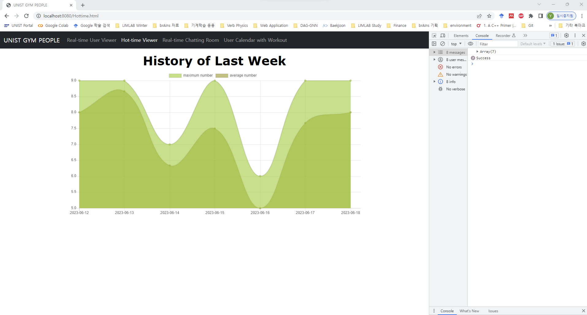
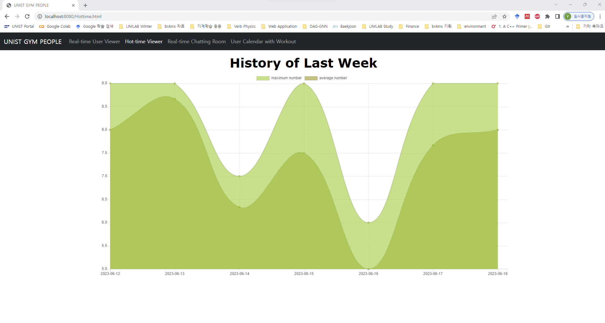
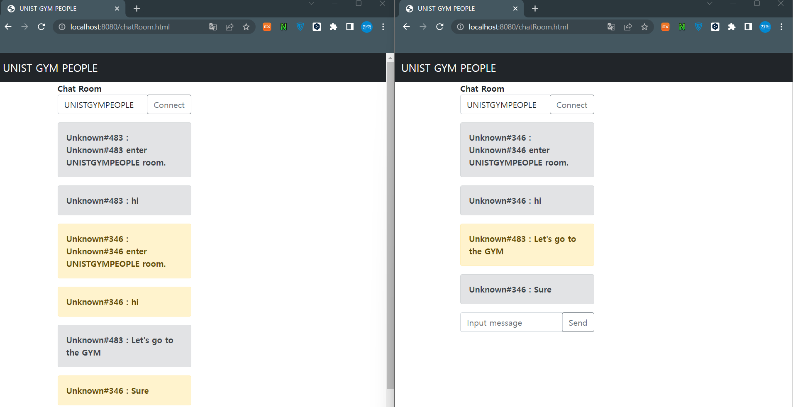
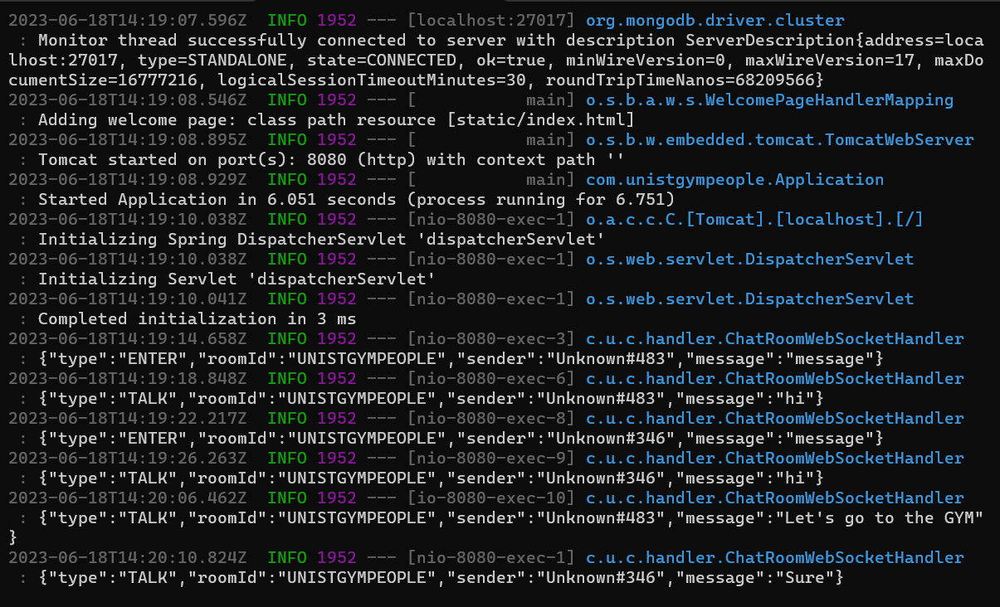

# CSE364Project
2023 CSE364 Group 28 Project - Milestone 2

## Part 1 : Create Git branches

You can execute `sh run.sh` as the following:
```
git clone https://github.com/ChanHyeok-Choi/CSE364Project.git
cd CSE364Project

# Create User Administrator MongoDB
mongod --fork --logpath /var/log/mongodb.log
mongosh admin --eval "db.createUser({ user: 'admin', pwd: 'password', roles: ['userAdminAnyDatabase'] })"

# Import data/*.csv to MongoDB
mongoimport --db=cse364 --collection=users --authenticationDatabase admin --username admin --password password --type=csv --file=data/users.csv --fields=userId.int32\(\),timeStamp.string\(\),userType.string\(\) --columnsHaveTypes
mongoimport --db=cse364 --collection=usernums --authenticationDatabase admin --username admin --password password --type=csv --file=data/usernums.csv --fields=date.string\(\),time.string\(\),userNumber.int32\(\) --columnsHaveTypes

mongoimport --db=cse364 --collection=calender --authenticationDatabase admin --username admin --password password --type=csv --file=data/calender.csv --fields=memberid.int32\(\),time.string\(\),event.string\(\),num.int32\(\) --columnsHaveTypes
mongoimport --db=cse364 --collection=exercise --authenticationDatabase admin --username admin --password password --type=csv --file=data/exercise.csv --fields=exercisetype.string\(\),percalorie.int32\(\) --columnsHaveTypes

mvn package
java -jar target/cse364-project-1.0-SNAPSHOT.jar
```

---

## Part 2 : Build Web Application (120 points, 40 points for each feature)

### Feature 1 : Real-Time User Viewer & Hot-Time Viewer

Users can access to see Real-Time User Viewer, by `http://localhost:8080/Realtime.html`. It shows the current user of the gym in the center blue circle. It differs from each 1 minutes if there is change in users. Also, the current time is shown under the page, for convenience.

Users can access to see Hot-Time Viewer, by `http://localhost:8080/Hottime.html`. It show the last week (from current date) history of users. It shows data by line-graph with maximum number and average number of user history of each date.

### Feature 2 : Real-Time Chat Service

Before users start using live chat rooms, there is one prerequisite in server.

* Create the first open chat room by REST-API.
   ```
   curl -X POST http://localhost:8080/chat -H "Content-Type: application/json" -d "{ \ "name" : "ChatRoom1" \ }"
   > {"roomId":"UNISTGYMPEOPLE","name":"{ \\ name : ChatRoom1 \\ }","sessions":[]}
   ```

Then, users can automatically connect to the websocket when they open `http://localhost:8080/chatRoom.html`.
And users are given a random name: e.g., `Unknown#123` (Arbitrary number range: 1 ~ 500). And if they input
some messages and send them by the send button, text boxes that appear depend on the sender and receiver.

### Feature 3 : User's Workout Calender

Users can access to see data for their calendar, simply fill the form in `http://localhost:8080/Calender.html`. By Input both integer memberid and date, they will see the table for the data in the database.

If at least one space is blank, the error will happen and doesn't show the result.

Users can also access to save data for their calendar, simply click the button for "Save new" or visit `http://localhost:8080/CalendarSave.html`.

By Input all the forms, they can save data into the database, "Save Success" popup will appear, and redirect back to `http://localhost:8080/Calender.html`.

If some invalid input or some fields are not filled, "Error" popup will appear, and redirect back to `http://localhost:8080/Calender.html`.

---
  
## Part 3 : Deploy Application (40 points)

First add tomcat dependency for pom.xml. Also add finalname to remove the version number. Also change packaging to war instead of jar.
Then for main Springboot , it should extend SpringBootServletInitializer.
After, we can package by running Maven/cse-364project/Lifecycle/package. Then there will be cse364-project.war in target folder.

---

## Part 4 : Use Continuous Integration (GitHub Actions) (20 points)

You can see our simple CI at [here](./.github/workflows/main.yml).
For each pull request or push to main stream, set up Java 17 & Maven, then run build and test by `mvn clean package`.

---

## Part 5 : Write User Documentation (15 points)

When users firstly open our web application through `http://localhost:8080/chatRoom.html`, they can see our
logo as the following:


### Feature 1 : Real-Time User Viewer & Hot-Time Viewer

Users can open or access the url: `http://localhost:8080/Realtime.html` to see the current user of the gym. The user number
is updated automatically for each 1 minute. Current time is also shown under the page.


Users can open or access the url: `http://localhost:8080/Hottime.html` to see the hot-time of the gym. It shows the last week's maximum and average number of users at gym. At first time, the page is not loaded fully, so user show press `F12` button to load it.



Then, it will be loaded and users can view line-graph. Users can see exact numbers by placing mouse pointer on the graph. The full view will be look like this.




### Feature 2 : Real-Time Chat Service

* **NOTE: If there doesn't exist ChatRoom made by server terminal, Chat Service doesn't work. So please make sure POST RestAPI to make a chat room on the terminal.**

Users just open or access the url: `http://localhost:8080/chatRoom.html`. And then, they input a text message
and eventually click the send button for sending it to other users. Messages sent by you appear in gray, and messages received from others appear in yellow.
You can see the example as the following:

The relevant logs can be showed on the server as following:


### Feature 3 : User's Workout Calender

To save the event on date, access the url: `http://localhost:8080/CalendarSave.html`. 

Or access from`http://localhost:8080/Calender.html` and click the "Save new" Button.

And then, input a Member Id, Date, Exercise Type, and Number value to save the data to database.

If success, "Save Success"  will appear but if fails, "Error" will appear. And it directs them to `http://localhost:8080/Calender.html`.


To view the event on date you saved, access the url `http://localhost:8080/Calender.html`.

To search, fill the Member Id and Date, and it will show the data they saved in the table

and below table shows the total calorie they spent on that specific date.

Button "Save new" directs them to `http://localhost:8080/CalendarSave.html`.


